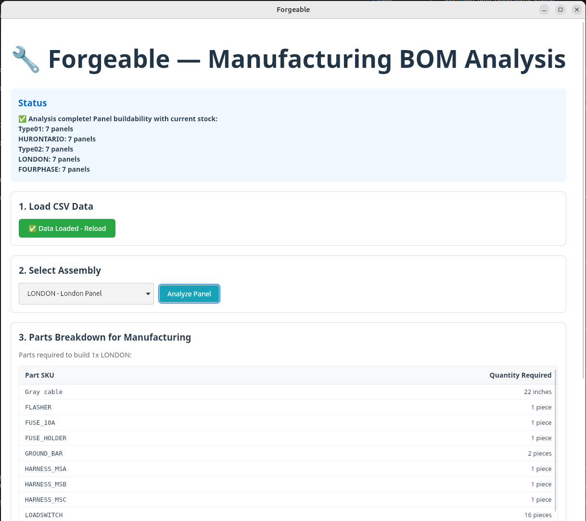
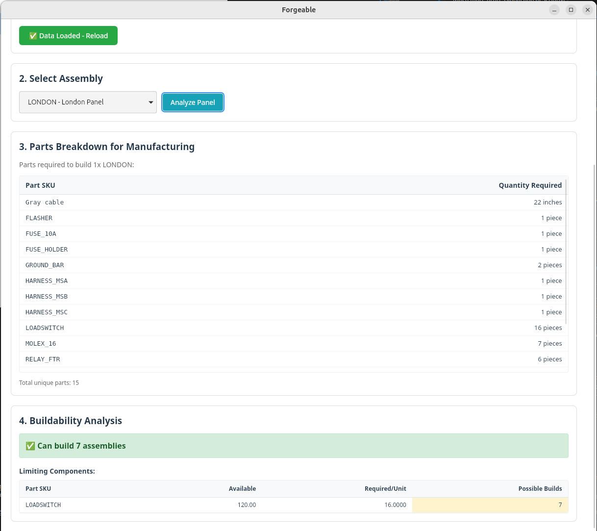

# Forgeable v1.0.0

**Manufacturing Analysis Desktop Application**

Forgeable is a desktop application designed for manufacturing analysis, specifically focused on backpanel assembly production planning. It provides comprehensive Bill of Materials (BOM) analysis, stock-based buildability calculations, and production planning insights.

## 🚀 Features

### **Panel Analysis**

- **BOM Explosion**: Break down any panel assembly into its constituent parts and components
- **Stock-based Buildability**: Calculate how many panels can be built with current inventory
- **Multi-panel Analysis**: Analyze all panel types simultaneously to see production capacity

### **Manufacturing Intelligence**

- **Limiting Component Detection**: Identify which parts constrain production capacity
- **Parts Breakdown**: Detailed view of all components needed for manufacturing
- **Production Planning**: Real-time analysis of what can be built with available stock

### **User Experience**

- **Clean Interface**: Intuitive desktop application with clear navigation
- **Real-time Analysis**: Instant feedback and calculations
- **Professional Reporting**: Formatted results with proper units and descriptions

## � Screenshots

### Application Interface


_Main application interface showing data loading, panel selection, and real-time buildability status for all panel types_

### Parts Breakdown Analysis


_Detailed parts breakdown for manufacturing with clean formatting, proper units, and limiting components analysis_

## �🛠️ Technology Stack

- **Frontend**: React 19 + TypeScript + Vite
- **Backend**: Rust (Tauri 2.9)
- **Data**: CSV file processing
- **Platform**: Cross-platform desktop application

## 📋 Prerequisites

- **Node.js** (Latest LTS version)
- **Rust** (Latest stable version)
- **CSV Data Files** in the following format:

### Required CSV Files Structure

```
data/
├── assemblies.csv      # Panel definitions
├── parts.csv          # Component catalog
├── bom_items.csv      # Bill of materials relationships
└── stock.csv          # Current inventory levels
```

#### CSV File Formats

**assemblies.csv**

```csv
assembly_sku,name,uom
TS2_TYPE01,Type 01 Panel,ea
TS2_TYPE02,Type 02 Panel,ea
```

**parts.csv**

```csv
part_sku,name,uom
LOADSWITCH,Load Switch,ea
FLASHER,Flasher,ea
CABLE_GRAY,Gray Cable,ft
```

**bom_items.csv**

```csv
parent_assembly_sku,component_sku,qty_per,scrap_rate,yield_pct,is_phantom
TS2_TYPE01,LOADSWITCH,16,0.00,1.00,false
TS2_TYPE01,FLASHER,1,0.00,1.00,false
```

**stock.csv**

```csv
sku,on_hand_qty,reserved_qty
LOADSWITCH,120,0
FLASHER,30,0
CABLE_GRAY,500,0
```

## 🚦 Getting Started

### Installation

1. **Clone the repository**

   ```bash
   git clone <repository-url>
   cd Forgeable
   ```

2. **Install dependencies**

   ```bash
   cd apps/ui
   npm install
   ```

3. **Prepare your data**

   - Place your CSV files in `/home/johed/Documents/CsvFiles/Forgeable/data/`
   - Ensure all CSV files follow the required format

4. **Run the application**

   ```bash
   # Development mode
   ./run-dev.sh

   # Or manually
   cd apps/ui
   npm run tauri:dev
   ```

### Building for Production

```bash
cd apps/ui
npm run tauri:build
```

## 📖 Usage

### Basic Workflow

1. **Load Data**: Click "Load CSV Data" to import your manufacturing data
2. **Select Panel**: Choose a panel type from the dropdown menu
3. **Analyze**: Click "Analyze Panel" to perform BOM explosion and buildability analysis
4. **Review Results**:
   - View buildability for all panel types in the status section
   - Examine detailed parts breakdown for the selected panel
   - Check limiting components that constrain production

### Understanding the Results

#### Status Section

Shows how many panels of each type can be manufactured:

```
✅ Analysis complete! Panel buildability with current stock:
Type01: 7 panels
Type02: 12 panels
Type03: 5 panels
```

#### Parts Breakdown

Lists all components needed to build one panel:

```
LOADSWITCH      16 pieces
FLASHER         1 piece
Gray cable      2.5 inches
```

#### Limiting Components

Identifies bottlenecks in production:

- Shows which parts limit production capacity
- Displays available stock vs. required quantities
- Calculates maximum possible builds per component

## 🎯 Key Concepts

### **BOM Explosion**

The process of "exploding" a complex assembly into all its individual components. Starting with a finished panel, the system recursively breaks down sub-assemblies until it reaches basic parts, calculating total quantities needed.

### **Limiting Components**

Parts that constrain production capacity. Like a chain being only as strong as its weakest link, production is limited by whichever component runs out first. For example, if you need 16 load switches per panel but only have 120 in stock, you can only build 7 panels (120 ÷ 16 = 7.5, rounded down).

### **Buildability Analysis**

Real-time calculation of manufacturing capacity based on current inventory levels, taking into account all component requirements and stock constraints.

## 📁 Project Structure

```
Forgeable/
├── apps/ui/                    # React frontend application
│   ├── src/
│   │   ├── components/         # React components
│   │   ├── domain/            # Business logic
│   │   │   ├── bomExplode.ts  # BOM explosion algorithms
│   │   │   ├── limitingReagent.ts # Buildability calculations
│   │   │   └── types.ts       # TypeScript interfaces
│   │   ├── services/          # External service integrations
│   │   └── App.tsx           # Main application component
│   └── src-tauri/            # Rust backend
│       └── src/
│           ├── data.rs       # CSV data processing
│           ├── lib.rs        # Tauri application setup
│           └── main.rs       # Application entry point
├── run-dev.sh               # Development startup script
└── README.md               # This file
```

## 🔧 Configuration

### Data Directory

Update the data directory path in `App.tsx` if your CSV files are located elsewhere:

```typescript
const DATA_DIR = "/path/to/your/csv/files";
```

### CSV Processing

The application uses snake_case field names consistently across all data layers. Ensure your CSV headers match the expected format.

## 🤝 Contributing

This project follows standard practices:

- TypeScript for type safety
- Snake_case naming convention for data fields
- Comprehensive error handling and validation
- Clean, maintainable code architecture

## 📝 Version History

### v1.0.0 (Current)

- ✅ Complete BOM explosion functionality
- ✅ Multi-panel buildability analysis
- ✅ Professional UI with clean terminology
- ✅ Comprehensive error handling and data validation
- ✅ Snake_case standardization across all layers
- ✅ Enhanced user experience with descriptive units and formatting

## 📄 License

This project is part of the Forgeable manufacturing analysis suite.

---

**Built with ❤️ for manufacturing excellence**
